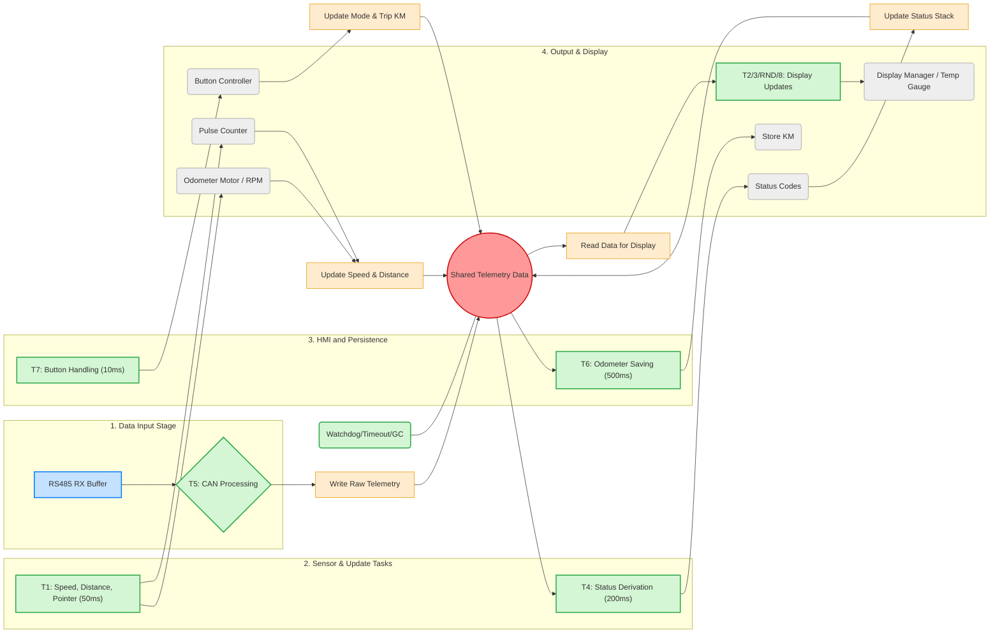

# Display-Unit-DU-Electric-Vehicle-Dashboard-Controller  

**DU = Display Unit** – A modular, non-blocking, flash-optimized controller for EV instrumentation.  
> **Revival of analog precision** using **RP2040 + MicroPython v1.26.0 + uasyncio**

## Why this project exists
In classic cars, instruments were driven by cables or sensors. After EV conversion? **All gone.**  
This project brings back the **original look** – but smarter, smoother, and fully digital under the hood.

**No direct CANbus** (yet) – we use a pre-processed RS485 telemetry stream.  
Why? **RP2040 + MicroPython** are fast enough for 20 Hz pointers and 12 async tasks – but not for full CAN parsing.  

---

## Core Features (v1.0 – MicroPython 1.26.0)

| Feature | Item | Description | Tech |
|-------|------|------|---|
| **Analog Speedometer** | B | 480-step precision, 20 Hz update | `#stepper-motor`, `FullStep` |
| **Analog Tachometer** | E | 0–12,000 RPM via PWM | `#pwm-output`, `rpm2.py` |
| **Temperature Gauges** | L | Motor + MCU temp | `#temp-gauge` |
| **3x SSD1306 OLED** | A/S/H | Async, dirty-rect, 1 Hz refresh | `#oled`, `#i2c`, `#uasyncio` |
| **Persistent Odometer** | A | Survives power loss (LittleFS) | `#littlefs`, `store_km.py` |
| **Button Matrix** | C | Short/long press, debounce | `#button-input` |
| **RS485 Telemetry** | – | Custom protocol (115200 baud) | `#rs485`, `#serial` |
| **Watchdog + GC** | – | 5s hardware WDT, auto-reboot on freeze | `#stability` |
---

## Hardware

| Component | Details |
|---------|--------|
| **MCU** | Longan CANBED RP2040 |
| **Displays** | 3x SSD1306 OLED (128x32, 64x32), I2C |
| **Stepper Motor** | 4-phase, FullStep, 946 steps/rev, pins 10,20,19,29 |
| **RS485 Transceiver** | TTL to RS485, 115200kbps |
| **Sensors** | Wheel speed pulse, CAN telemetry |
| **Storage** | LittleFS on Pico flash (odometer persistence) |
| **Power** | 12V supply, 5V regulated, 3.3V logic |

---

# Software Architecture

## Asynchronous Task and Data Flow (main.py)

The core architecture relies on the Shared Telemetry Data object, which acts as the central state store, enabling communication between the simultaneously running uasyncio tasks.

# **Asynchronous Data Flow Architecture: Shared Telemetry Data (SD)**

## **1\. Overview and Core Principle**

This document outlines the asynchronous architecture for the embedded system, which relies on a centralized data structure to manage state and communication between independent software tasks.

The core principle is the **Shared Telemetry Data (SD)**. This is a globally accessible, mutex-protected data structure that acts as the **single source of truth** for all operational parameters (sensor readings, status, configuration, and display variables).

### **Goal of the SD**

By centralizing all system state, we ensure **data consistency** and simplify inter-task communication, eliminating direct (and often complex) task-to-task messaging. All tasks follow a simple **Read \-\> Process \-\> Write** pattern against the SD.

## **2\. Shared Telemetry Data (SD) \- Central Component**

The **Shared Telemetry Data (SD)** is the nexus of the system. Every major task either reads from it to make decisions or writes to it to update the system state.

| Data Category | Purpose | Example Data Points | Interacting Tasks |
| :---- | :---- | :---- | :---- |
| **Input Telemetry** | Raw data received from external sources. | CAN\_raw\_speed, RS485\_status | T5 (CAN Processing) |
| **Operational State** | Calculated, real-time measurements. | Current\_Speed, Total\_Distance\_KM, Trip\_Distance\_KM | T1, T4, T7 |
| **Status Flags** | System health and mode configuration. | Status\_Stack\_Error, Operation\_Mode | T4, T7 |
| **Persistence Data** | Values needing permanent storage. | Total\_Odometer\_KM | T6 (Odometer Saving) |

## **3\. Task Breakdown and Data Flow**

The system is organized into four main stages, with each task accessing the SD for its specific operation.

### **3.1. Stage 1: Data Input**

This stage is responsible for receiving external data and updating the raw telemetry section of the SD.

| Task | Frequency | Description | SD Interaction |
| :---- | :---- | :---- | :---- |
| **T5: CAN Processing** | Event-driven (high priority) | Receives raw sensor and diagnostic data from the CAN bus (or RS485 buffer). | **WRITE:** Writes received raw values directly to the Input Telemetry section of the SD (Write Raw Telemetry). |

### **3.2. Stage 2: Sensor and Update Tasks (Core Logic)**

These tasks perform calculations and update the main operational state variables.

| Task | Frequency | Description | SD Interaction |
| :---- | :---- | :---- | :---- |
| **T1: Speed, Distance, Pointer** | 50 ms | Reads raw speed/pulse inputs (Pulse Counter) and calculates Current\_Speed and running distance. | **READ & WRITE:** Updates the Speed and Distance fields in the Operational State (Update Speed & Distance). |
| **T4: Status Derivation** | 200 ms | **READ:** Checks various SD fields (Input Telemetry, Operational State) to derive the overall system status. | **WRITE:** Updates the Status\_Stack\_Error in the Status Flags section (Update Status Stack). |

### **3.3. Stage 3: HMI and Persistence**

This stage manages user interaction and critical data storage.

| Task | Frequency | Description | SD Interaction |
| :---- | :---- | :---- | :---- |
| **T7: Button Handling** | 10 ms | Manages input from the Button Controller to trigger mode changes (e.g., reset trip meter, change display view). | **WRITE:** Updates the Operation\_Mode and resets Trip\_Distance\_KM within the Operational State (Update Mode & Trip KM). |
| **T6: Odometer Saving** | 500 ms | **READ:** Reads the current Total\_Distance\_KM. | **WRITE:** Persists the Total\_Odometer\_KM to non-volatile memory (e.g., EEPROM, Flash) via the Store KM module. |

### **3.4. Stage 4: Output and Display**

These tasks exclusively read the final, processed data from the SD to update outputs and the Human-Machine Interface (HMI).

| Task | Description | SD Interaction |
| :---- | :---- | :---- |
| **T2/3/RND/8: Display Updates** | A collection of tasks dedicated to refreshing various display segments (e.g., graphical elements, numeric readouts). | **READ:** Reads all necessary data (speed, status, distance, temperature) from the SD (Read Data for Display) and renders it to the HMI (Display Manager / Temp Gauge). |

## **4\. Synchronization and Mutual Exclusion**

Given that multiple tasks (T1, T4, T5, T7) can write to the SD simultaneously, the SD structure **MUST** be protected by a Mutual Exclusion mechanism (e.g., a **Mutex** or **Semaphore**).

All Read and Write operations must:

1. Acquire the Mutex.  
2. Perform the data access (read or write).  
3. Release the Mutex.

This mechanism prevents data corruption and ensures that the SD always contains atomic, consistent state updates.
